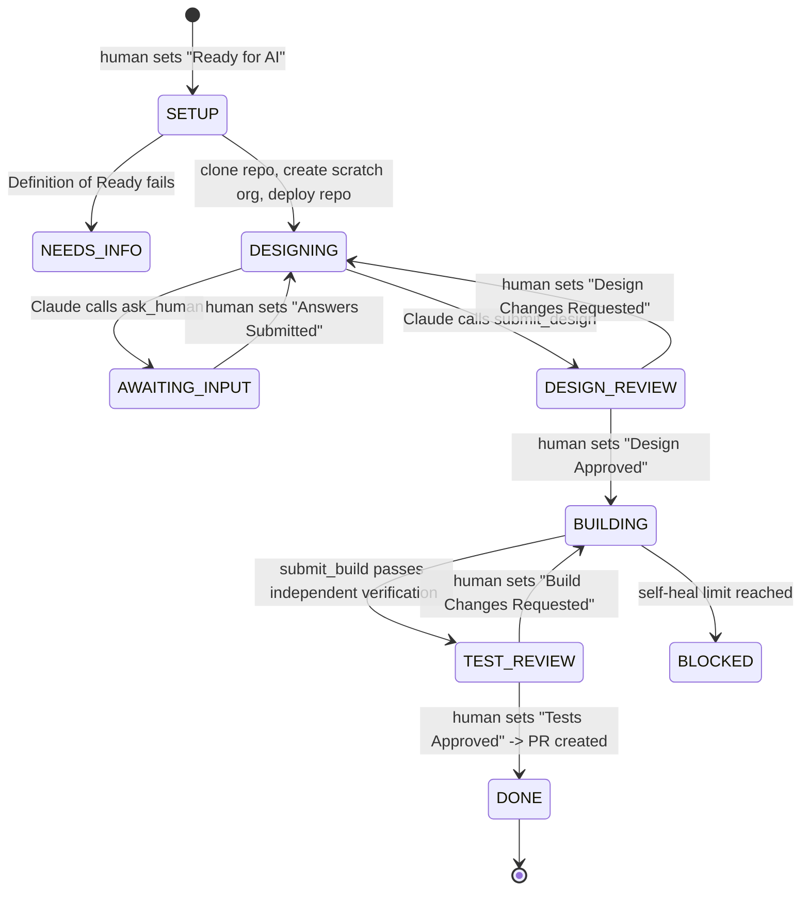

# Autonomous SDLC with Claudeforce — POC

**Salesforce Beyond CRM: Orchestrating the Autonomous SDLC with Claudeforce**

A Python orchestrator that takes a Jira ticket from *Ready for AI* to a GitHub pull request.
Claude does the reasoning, the Salesforce DX MCP server provides governed org access,
and humans approve at two gates (design and test results).

## Roles

| Piece | MCP role | What it does |
|---|---|---|
| This Python app | **Host** (contains the MCP **client**) | Webhooks, state machine, agent loop, Jira/GitHub calls, independent verification |
| Salesforce DX MCP server (`@salesforce/mcp`) | **Server** | Exposes org capabilities (query, metadata, tests) as tools. Started per run, scoped to one org |
| Claude API | Model | Decides which tool to call, writes the design and code |
| Jira | Human interface | Input tickets, questions, approvals |
| GitHub | Source of truth | Fresh clone per ticket, `ai/<KEY>` branch, PR |

## Flow



Key principles:
- **The agent never waits.** It saves state (SQLite), posts to Jira, and exits. The next human transition resumes it.
- **Claude handles judgment; code handles plumbing.** Cloning, org creation, deploy verification and PR creation are deterministic Python.
- **Trust but verify.** When Claude calls `submit_build`, the pipeline deploys and runs tests itself. Failures go back to Claude (max `MAX_HEAL_ATTEMPTS`).
- **Least privilege.** Each run starts its own DX MCP server with `--orgs <this ticket's org>` only. No production credentials exist anywhere in the app.

## Project layout

```
app/
  main.py            FastAPI: Jira webhook, manual trigger, status endpoint
  orchestrator.py    State machine: start, resume_design, revise_design, build, raise_pr
  agent/loop.py      Claude tool-use loop + MCP client bridge to the DX MCP server
  agent/local_tools.py  Repo tools: list/read/search/write (writes only under force-app/)
  agent/prompts.py   System prompts, ask_human / submit_design / submit_build schemas
  sf_cli.py          sf CLI: scratch org lifecycle, deploy, independent verification
  jira_client.py     Jira REST v2: issue, comments, transitions, attachments
  git_github.py      Git workspace + GitHub PR API
  state.py           Per-ticket durable state
config/registry.yaml Jira project -> repo + org strategy
```

## Setup

### 1. Local prerequisites
Python 3.11+, Node.js 18+ (for `npx`), Salesforce CLI (`sf`), git.

```bash
python -m venv .venv && source .venv/bin/activate
pip install -r requirements.txt
cp .env.example .env        # fill it in
```

### 2. Salesforce
- Enable **Dev Hub** in a Developer Edition org and authorise it once:
  `sf org login web --alias devhub --set-default-dev-hub`
  (or configure the JWT variables in `.env` for headless servers).
- Your repo must be an SFDX project with `config/project-scratch-def.json`.
- Optional but recommended: add a `CLAUDE.md` at the repo root with team conventions
  (trigger framework, naming, test data factory). The agent reads it.
- Check the DX MCP tools once: `npx -y @salesforce/mcp@latest --help`. The app logs the
  discovered tool names at the start of each run.

### 3. GitHub
Fine-grained personal access token for the repo with **Contents: read/write** and
**Pull requests: read/write**. (Use a GitHub App in production.)

### 4. Jira
1. **Statuses:** add these to the project workflow. For the POC, make every status reachable from any status ("allow all statuses to transition to this one").
   - Human-set: `Ready for AI`, `Answers Submitted`, `Design Approved`, `Design Changes Requested`, `Tests Approved`, `Build Changes Requested`
   - Bot-set: `AI Analyzing`, `AI Needs Info`, `AI Awaiting Input`, `AI Design Review`, `AI Building`, `AI Test Review`, `PR Raised`, `AI Blocked`
2. **API token:** https://id.atlassian.com/manage-profile/security/api-tokens
3. **Webhook:** Jira Settings → System → WebHooks
   - URL: `https://<your-ngrok-host>/webhooks/jira?token=<WEBHOOK_TOKEN>`
   - Events: *Issue → updated*; JQL filter: `project = SFDEV`
4. **Ticket template** (the Definition of Ready check looks for the first two sections):

```
h2. Business Goal
When a Case is escalated, the account owner must follow up within 24h.

h2. Acceptance Criteria
- GIVEN a Case with IsEscalated = false WHEN it changes to true THEN a Task is created for Account.OwnerId, due in 1 day
- GIVEN a Case with no Account WHEN escalated THEN no Task is created and no error is thrown

h2. Out of Scope
Email notifications.
```

### 5. Run
```bash
uvicorn app.main:app --port 8000
ngrok http 8000        # expose to Jira
```

Without webhooks (useful for rehearsing the demo):
```bash
curl -X POST "http://localhost:8000/run/SFDEV-1/START?token=change-me"
curl "http://localhost:8000/runs/SFDEV-1?token=change-me"
```

## Demo script (≈ 8 minutes)
1. Show the ticket and move it to **Ready for AI**.
2. Show the logs: repo cloned, scratch org created, DX MCP tools discovered, Claude exploring the repo.
3. Jira shows clarification questions → answer them → **Answers Submitted**.
4. Design v1 appears (comment, attachment, file on the `ai/` branch) → request one change → v2 → **Design Approved**.
5. Logs show the build and self-healing (deploy/test errors fed back to Claude).
6. Test report with coverage table and diff link → **Tests Approved** → PR link.

Record a backup video; live scratch-org creation can be slow.

## Known limits (say these in the deck)
- One Jira project ↔ one repo per registry entry; monorepos need component-based routing.
- Flows and declarative metadata are deployed and validated, but only Apex gets coverage gating.
- The pipeline stops at the PR. Release to production stays in your existing CI/CD with human merge.
- Duplicate webhook events are dropped per ticket. Events arriving during a long run are ignored.
